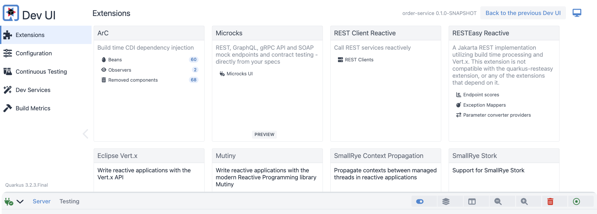

# Microcks Quarkus

Quarkus extension that enables embedding Microcks as a DevService managing mocks for dependencies and contract-testing your API endpoints

Want to see this extension in action? Check out our [sample application](https://github.com/microcks/api-lifecycle/tree/master/shift-left-demo/quarkus-order-service). 🚀

[](https://github.com/microcks/microcks-quarkus/actions)
[]((https://search.maven.org/artifact/io.github.microcks.quarkus/quarkus-microcks-parent))
[](https://www.apache.org/licenses/LICENSE-2.0)
[](https://microcksio.zulipchat.com/)

## Build Status

Latest released version is `0.1.0`.

Current development version is `0.1.1-SNAPSHOT`.

#### Sonarcloud Quality metrics

[](https://sonarcloud.io/summary/new_code?id=microcks_microcks-quarkus)
[](https://sonarcloud.io/summary/new_code?id=microcks_microcks-quarkus)
[](https://sonarcloud.io/summary/new_code?id=microcks_microcks-quarkus)
[](https://sonarcloud.io/summary/new_code?id=microcks_microcks-quarkus)
[](https://sonarcloud.io/summary/new_code?id=microcks_microcks-quarkus)
[](https://sonarcloud.io/summary/new_code?id=microcks_microcks-quarkus)
[](https://sonarcloud.io/summary/new_code?id=microcks_microcks-quarkus)

## How to use it?

### Include it into your project dependencies

If you're using Maven:
```xml
<dependency>
  <groupId>io.github.microcks.quarkus</groupId>
  <artifactId>quarkus-microcks</artifactId>
  <version>0.1.0</version>
  <scope>provided</scope>
</dependency>
```

Don't forget to specify the `provided` scope as the extension is just for easing your life during development mode and tests 👻

### Configuring the DevServices

By default, and if global DevServices are not disabled, Microcks DevService will run on next `mvn quarkus:dev`, launching 
a Microcks Testcontainer to handle your mock dependencies.  You can obviously fine-tune the configuration using properties 
in `application.properties`. Microcks related properties have the `quarkus.microcks` prefix.

You can explicitly disable Microcks DevService if you want save some resources at some point:

```properties
quarkus.microcks.devservices.enabled=false
```

The local URL exposed by the Microcks container Http port is automatically stored into the `quarkus.microcks.default.http` property.
Microcks container also exposes a gRPC URL for gRPC services, it is store into the `quarkus.microcks.default.grpc` property.

Exposed URL is visible in the Quarkus startup logs:

```shell
Listening for transport dt_socket at address: 5005
2023-08-09 12:27:22,649 INFO  [io.git.mic.qua.dep.DevServicesMicrocksProcessor] (build-31) The 'default' microcks container is ready on http://localhost:9191
__  ____  __  _____   ___  __ ____  ______ 
 --/ __ \/ / / / _ | / _ \/ //_/ / / / __/ 
 -/ /_/ / /_/ / __ |/ , _/ ,< / /_/ /\ \   
--\___\_\____/_/ |_/_/|_/_/|_|\____/___/   
2023-08-09 12:27:23,169 INFO  [io.quarkus] (Quarkus Main Thread) order-service 0.1.0-SNAPSHOT on JVM (powered by Quarkus 3.2.3.Final) started in 4.935s. Listening on: http://localhost:8080
2023-08-09 12:27:23,170 INFO  [io.quarkus] (Quarkus Main Thread) Profile dev activated. Live Coding activated.
2023-08-09 12:27:23,170 INFO  [io.quarkus] (Quarkus Main Thread) Installed features: [cdi, microcks, rest-client-reactive, rest-client-reactive-jackson, resteasy-reactive, resteasy-reactive-jackson, smallrye-context-propagation, vertx]
```

You can also access to Microcks UI using the Quarkus DevUI on http://localhost:8080/q/dev-ui:




### Import content in Microcks

To use Microcks mocks or contract-testing features, you first need to import OpenAPI, Postman Collection, GraphQL or gRPC 
artifacts. Artifacts can be imported as main/primary ones or as secondary ones. 
See [Multi-artifacts support](https://microcks.io/documentation/using/importers/#multi-artifacts-support) for details.

This is done automatically at container startup depending on your configuration. Use the `artifact.primaries` and `artifact.secondaries` for that.
They are comma-separated lists of paths to your OpenAPI, GraphQL, gRPC, SoapUI or Postman artifacts.

```properties
quarkus.microcks.devservices.artifacts.primaries=target/classes/order-service-openapi.yaml,target/test-classes/third-parties/apipastries-openapi.yaml
quarkus.microcks.devservices.artifacts.secondaries=target/test-classes/third-parties/apipastries-postman-collection.json
```

### Using mock endpoints for your dependencies

At development time or during your unit tests setup, you'd probably need to configure mock endpoints provided by Microcks 
containers to set up your base API url calls. For that, you have to configure the host exposition port and change URLs in config:

```properties
# Specify here the Mock URL provided by microcks devservices, referencing the quarkus.microcks.default.http
quarkus.rest-client."org.acme.order.client.PastryAPIClient".url=${quarkus.microcks.default.http}/rest/API+Pastries/0.0.1
```

### Launching new contract-tests

If you want to ensure that your application under test is conformant to an OpenAPI contract (or many contracts),
you can launch a Microcks contract/conformance test using the local server port you're actually running. Microcks container
is automatically configured for being able to reach your local application on the configured or default `quarkus.http.test-port`:

```java
@ConfigProperty(name= "quarkus.http.test-port")
int quarkusHttpPort;

@ConfigProperty(name= "quarkus.microcks.default.http")
String microcksContainerUrl;

@Test
public void testOpenAPIContract() throws Exception {
  // Ask for an Open API conformance to be launched.
  TestRequest testRequest = new TestRequest.Builder()
      .serviceId("Order Service API:0.1.0")
      .runnerType(TestRunnerType.OPEN_API_SCHEMA.name())
      .testEndpoint("http://host.testcontainers.internal:" + quarkusHttpPort + "/api")
      .build();

  TestResult testResult = MicrocksContainer.testEndpoint(microcksContainerUrl, testRequest);
  assertTrue(testResult.isSuccess());
```

The `TestResult` gives you access to all details regarding success of failure on different test cases.

A comprehensive Quarkus demo application illustrating both usages is available here: [quarkus-order-service](https://github.com/microcks/api-lifecycle/tree/master/shift-left-demo/quarkus-order-service).